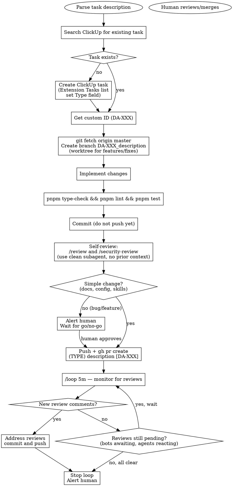

# da-dev — Development Workflow

Orchestrates: ClickUp task → branch → implement → PR → review monitoring → human handoff.

## Input

`/da-dev <description of the change>`

If the description is ambiguous, ask one round of clarifying questions before starting.

## Workflow



## Step Details

### 1. ClickUp Task

Search Extension Tasks list for an existing task. If none, create one:

- **List ID**: `901309979467` (Extension Tasks under Dev tasks)
- **Type field ID**: `e8372633-e6ec-4cec-93ab-bea34f57f701`
- **Type option IDs**:
  - Extension: `8a8f30a3-3f61-452a-9c90-132149f3ea71`
  - App: `301521c2-4110-439c-8d87-92cfbf62ca48`
  - Proxy: `43ba1953-371b-49f5-9a8c-ebdb6cfa7bad`
  - Chore: `1c48d81d-fb7f-474e-9d28-09c024f1314d`
  - Docs: `8f33f585-082f-4eb2-b229-5d235e8689e2`

Pick the Type based on the scope of the change. Get the custom ID (DA-XXX) from the created/found task.

### 2. Branch

```bash
git fetch origin master
# For features/fixes — use a worktree:
git worktree add ../danmaku-anywhere-DA-XXX -b DA-XXX_description origin/master
# For trivial changes — branch directly:
git checkout -b DA-XXX_description origin/master
```

Reuse an existing worktree if its previous work is already done.

### 3. Implement

Make the changes. Follow CLAUDE.md conventions.

### 4. Verify

Always run lint and type-check. For tests and build verification, follow the relevant area's process:

| Area | Verify command | Notes |
|---|---|---|
| Extension | See `packages/danmaku-anywhere/AGENTS.md` | Build with `pnpm dev` or `pnpm build` in package dir |
| Web app | See `app/web/AGENTS.md` | Build with `pnpm ng build` in app dir |
| Backend | See `backend/proxy/AGENTS.md` | Tests fail on Windows (workerd EBUSY) — use WSL or CI |
| Packages | `pnpm test --filter <package>` | Run tests for affected packages |
| Cross-cutting | `pnpm type-check && pnpm lint && pnpm test` | Full suite, exclude backend on Windows if untouched |

When the change spans multiple areas, verify each affected area.

### 5. Commit (do not push yet)

```bash
git add <specific files>
git commit -m "<descriptive message>"
```

Never include Co-Authored-By or AI attribution in commits.

### 6. Self-Review

Before pushing, run reviews using **clean subagents** (no prior context on the changes):

- Always run `/review` (code review)
- Run `/security-review` when the change touches code that handles user input, auth, APIs, or data storage

Use the Agent tool to dispatch these in a clean context. Fix any issues found, then amend or add a commit.

### 7. Human Gate

Determine if the change is **simple** (docs, config, skills, formatting) or **substantive** (bug fix, feature, refactor):

- **Simple**: proceed directly to PR
- **Substantive**: alert the human with a summary of changes and review results. **Wait for explicit go** before proceeding
- **When in doubt**: alert the human

### 8. Push and Create PR

```bash
git push -u origin DA-XXX_description
gh pr create --title "(type) description [DA-XXX]" --body "$(cat <<'EOF'
## Summary
- <bullet points>
EOF
)"
```

- **TYPE** must be one of: `extension`, `app`, `proxy`, `chore`, `docs`
- **TYPE must match** the ClickUp task's Type field (CI validates this)
- **DA-XXX must match** the branch name (CI validates this)
- Do NOT include ClickUp links in the PR body — they are posted automatically

### 9. Review Monitoring

```
/loop 5m check PR #N for review comments, report reviewer status, address comments, and push fixes
```

**Each loop iteration must report status** by running these checks and printing results:

```bash
# Review states (COMMENTED, APPROVED, CHANGES_REQUESTED, PENDING, DISMISSED)
gh api repos/Mr-Quin/danmaku-anywhere/pulls/N/reviews --jq '[.[] | {author: .user.login, state: .state}]'
# PR reactions (eyes emoji = bot is processing)
gh api repos/Mr-Quin/danmaku-anywhere/issues/N/reactions --jq '[.[] | {user: .user.login, reaction: .content}]'
# Pending reviewer requests
gh api repos/Mr-Quin/danmaku-anywhere/pulls/N --jq '{requested_reviewers: [.requested_reviewers[]? | .login]}'
# Inline comments
gh api repos/Mr-Quin/danmaku-anywhere/pulls/N/comments
```

Report a summary like:
> **PR #N status**: Copilot: COMMENTED (1 comment), Gemini: eyes reaction (processing). 1 unresolved thread.

**When review comments are found:**

1. **Evaluate each comment** — determine if the feedback is valid and worth addressing. Not all bot suggestions are correct.
2. **If valid**: make the fix, then reply to the thread with a short comment explaining what was changed
3. **If not valid**: reply to the thread explaining why the suggestion was declined
4. **Resolve the thread** after replying:

```bash
# Get unresolved thread IDs
gh api graphql -f query='{ repository(owner: "Mr-Quin", name: "danmaku-anywhere") { pullRequest(number: N) { reviewThreads(first: 50) { nodes { id isResolved } } } } }'
# Resolve each thread
gh api graphql -f query='mutation { resolveReviewThread(input: {threadId: "THREAD_ID"}) { thread { isResolved } } }'
```

**Stop the loop when:**
1. All review comments have been addressed/declined and threads resolved — stop loop, alert human
2. No comments AND no pending reviews — stop loop, alert human

**Keep looping when:**
- A bot has reacted with eyes emoji but hasn't posted a review yet
- `requested_reviewers` is non-empty
- A review state is PENDING

## Hard Rules

- **NEVER merge PRs** — merging is always a human action
- **NEVER skip the ClickUp task** — every PR needs a DA-XXX reference
- **NEVER force push** without explicit human approval
