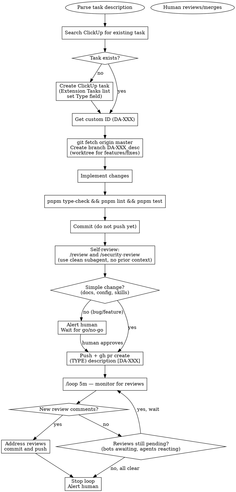

# da-dev — Development Workflow

Orchestrates: ClickUp task → branch → implement → PR → review monitoring → human handoff.

## Input

`/da-dev <description of the change>`

If the description is ambiguous, ask one round of clarifying questions before starting.

## Workflow



## Step Details

### 1. ClickUp Task

Search Extension Tasks list for an existing task. If none, create one:

- **List ID**: `901309979467` (Extension Tasks under Dev tasks)
- **Type field ID**: `e8372633-e6ec-4cec-93ab-bea34f57f701`
- **Type option IDs**:
  - Extension: `8a8f30a3-3f61-452a-9c90-132149f3ea71`
  - App: `301521c2-4110-439c-8d87-92cfbf62ca48`
  - Proxy: `43ba1953-371b-49f5-9a8c-ebdb6cfa7bad`
  - Chore: `1c48d81d-fb7f-474e-9d28-09c024f1314d`
  - Docs: `8f33f585-082f-4eb2-b229-5d235e8689e2`

Pick the Type based on the scope of the change. Get the custom ID (DA-XXX) from the created/found task.

### 2. Branch

```bash
git fetch origin master
# For features/fixes — use a worktree:
git worktree add ../danmaku-anywhere-DA-XXX -b DA-XXX_short-description origin/master
# For trivial changes — branch directly:
git checkout -b DA-XXX_short-description origin/master
```

Reuse an existing worktree if its previous work is already done.

### 3. Implement

Make the changes. Follow CLAUDE.md conventions.

### 4. Verify

```bash
pnpm type-check && pnpm lint && pnpm test
```

Skip backend/proxy tests on Windows (workerd EBUSY failures).

### 5. Commit (do not push yet)

```bash
git add <specific files>
git commit -m "<descriptive message>"
```

Never include Co-Authored-By or AI attribution in commits.

### 6. Self-Review

Before pushing, run reviews using **clean subagents** (no prior context on the changes):

- Always run `/review` (code review)
- Run `/security-review` when the change touches code that handles user input, auth, APIs, or data storage

Use the Agent tool to dispatch these in a clean context. Fix any issues found, then amend or add a commit.

### 7. Human Gate

Determine if the change is **simple** (docs, config, skills, formatting) or **substantive** (bug fix, feature, refactor):

- **Simple**: proceed directly to PR
- **Substantive**: alert the human with a summary of changes and review results. **Wait for explicit go** before proceeding
- **When in doubt**: alert the human

### 8. Push and Create PR

```bash
git push -u origin DA-XXX_short-description
gh pr create --title "(TYPE) description [DA-XXX]" --body "$(cat <<'EOF'
## Summary
- <bullet points>
EOF
)"
```

- **TYPE** must be one of: `extension`, `app`, `proxy`, `chore`, `docs`
- **TYPE must match** the ClickUp task's Type field (CI validates this)
- **DA-XXX must match** the branch name (CI validates this)
- Do NOT include ClickUp links in the PR body — they are posted automatically

### 9. Review Monitoring

```
/loop 5m <check PR #N for review comments, address them, push fixes>
```

**Stop the loop when:**
1. You've addressed all review comments — stop loop, alert human
2. No comments AND no pending reviews (no bots "awaiting review", no review agents still reacting) — stop loop, alert human

**Keep looping when:**
- Review bots are still processing (e.g., copilot status is "awaiting review")
- A review agent has reacted but not yet posted comments

## Hard Rules

- **NEVER merge PRs** — merging is always a human action
- **NEVER skip the ClickUp task** — every PR needs a DA-XXX reference
- **NEVER force push** without explicit human approval
