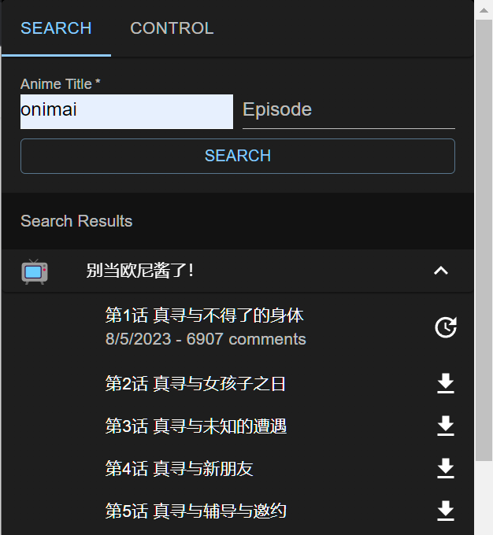
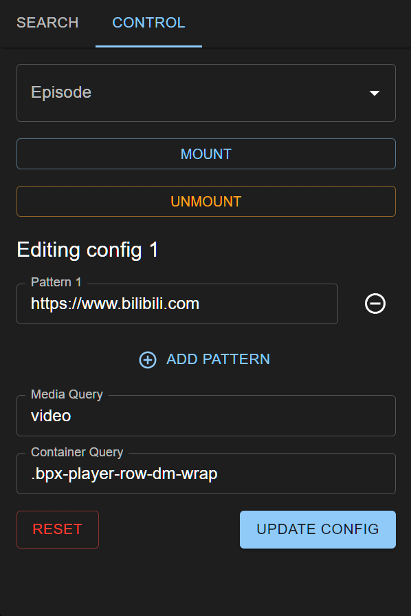

# danmaku-anywhere

For the userscript plex-danmaku, see [here](./packages/plex-danmaku).

Browser extension to inject danmaku into any webpage with a `<video>` player.

Currently wip, somewhat working but not user friendly.

## Screenshots

Plex


Crunchyroll


Billibili


Control panel




## Development

This is a pnpm monorepo.

### Install dependencies

In the root directory:

```bash
pnpm i
```

### Build shared libraries

In the root directory:

```bash
pnpm build
```

Now you can go to each package and run `pnpm dev` to start developing.
