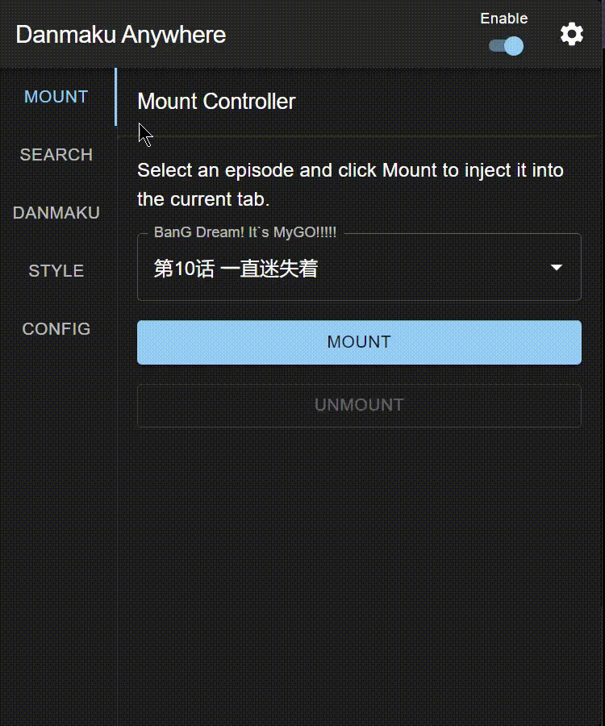

  
  <h1>
    Danmaku Anywhere
  </h1>

> 没有弹幕怎么看番？
> Danmaku Anywhere 是一个可以在任何视频网站上加载弹幕的浏览器插件

[中文] [English](./README.en.md)

## 功能 🚧

- 按动画搜索弹幕
- 将弹幕嵌入视频
- 自定义弹幕样式
- 本地弹幕缓存并导出为文件

所有弹幕均来自 [弹弹 play](https://www.dandanplay.com/)

## 截图

Plex

Crunchyroll

## 安装

正在尝试上架Chrome Web Store，在上架之前需手动安装

下载[最新发布的版本](https://github.com/Mr-Quin/danmaku-anywhere/releases/latest)然后解压到任意文件夹

> [!IMPORTANT]
> 除非删除扩展，请勿删除此文件夹

后续的更新直接解压到这个文件夹中并覆盖即可

### Chrome

1. 进入扩展页面 [chrome://extensions/](chrome://extensions/) 并启用开发者模式。
2. 点击 "加载未打包的扩展" 并选择已解压的扩展文件夹。

### Firefox

没有在Firefox上测试过所以不知道能不能用，但是后续计划支持Firefox

## 使用指南

此扩展程序提供两种模式：

- 手动模式： 手动搜索、挂载和卸载各个剧集的弹幕。可用于任何网站。
- 自动模式： 自动匹配并挂载弹幕，但是需要对每个网站进行适配（目前仅适用于 [Plex](https://www.plex.tv/)，包括自架版本）

### 1. 添加挂载配置

挂载配置决定在什么网站的什么位置加载弹幕

- 在扩展程序弹出窗口中，打开“Config”页
- 启用预设配置
- 如果你的网站不在预设列表中，点击“+”并输入：
  - 匹配模式： 网站的 URL 格式（例如，`https://your.website.com/*`）使用[匹配模式](https://developer.mozilla.org/zh-CN/docs/Mozilla/Add-ons/WebExtensions/Match_patterns)格式
  - 视频选择器：选择视频播放器（通常为`video`）使用[`querySelector`](https://developer.mozilla.org/zh-CN/docs/Web/API/Document/querySelector)格式

> [!IMPORTANT]
> 启用配置时会请求网站权限，不授予将无法使用。（稍后可以在“Options”页面中撤销权限，或通过删除配置来撤销权限。）

### 2. 搜索和挂载弹幕（手动模式或临时使用）

> [!TIP]
> 自动模式无需这些操作

- 在“Search”页中按标题查找剧集。
- 点击剧集以下载/更新弹幕。
- 在下拉菜单中选择剧集并点击“Mount”显示弹幕。
- 点击“Unmount”移除弹幕。

### 关闭插件/隐藏弹幕

- 全局“启用”开关：关闭弹幕相关的所用功能，可以在右键菜单中开关
- “显示弹幕”开关（Styles）： 暂时隐藏弹幕
- 禁用挂载配置（Mount Config）： 单独页面的开关，需要刷新页面才能生效

## 开发

见[英文文档](./README.en.md#development)

## 猴油脚本 （以停止维护）

[plex-danmaku](./packages/plex-danmaku)
