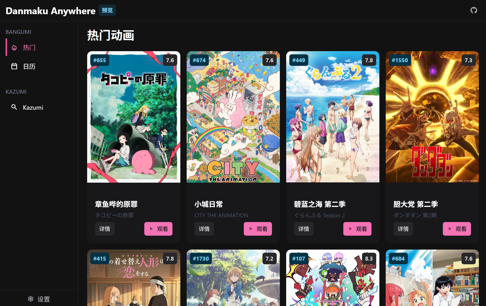
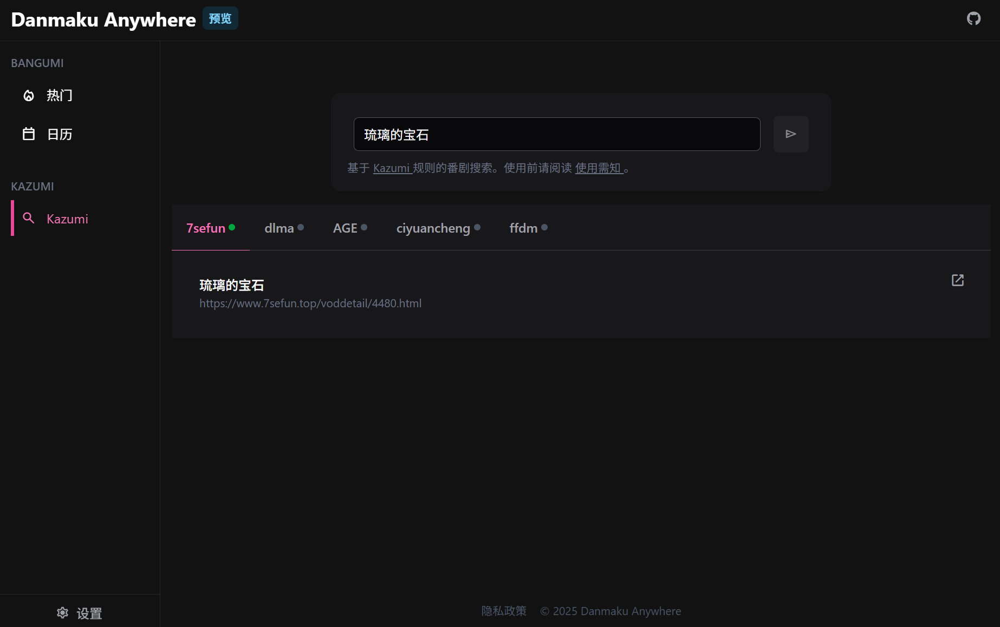

  
  <h1>
    弹幕任何地方
  </h1>
  
<em>Danmaku Anywhere</em>

  

    
    
        
    
    
  

> 没有弹幕怎么看番？
> **弹幕任何地方**是一个开源项目，旨在为你喜爱的几乎任何视频网站添加弹幕。

此项目包含多个子项目

- [浏览器扩展 - 给几乎任何网站添加弹幕](#extension)
- [Web应用 - 基于Kazumi规则的视频采集网站](#app)

## 🚀**弹幕任何地方** 浏览器扩展

### 功能特性

- **在几乎任何网站观看弹幕**：
    - 自托管的媒体服务器（如 Plex、Emby、Jellyfin、飞牛影视）
    - 流媒体平台（如 YouTube、Crunchyroll）
    - 其他视频网站
- **纯浏览器体验**：无需任何桌面客户端
- **从多个弹幕源获取弹幕**，目前支持：
    - 弹弹Play
    - B站
    - 腾讯
    - MacCMS (Vod)
    - 兼容弹弹Play API的服务，如[danmu-api](https://github.com/huangxd-/danmu_api)
- **手动导入**：支持手动导入本地弹幕文件 (`.xml` 格式)
- **自动匹配**：可自定义匹配规则，或使用AI匹配功能
    - 根据播放的视频，自动搜索弹幕
    - 自动关联同名的本地弹幕文件
- **弹幕导出**：将看过的弹幕导出为`.xml`文件

### 效果截图

<video src="https://github.com/user-attachments/assets/c5df8221-4381-4d58-9f88-3ca73a1431bb"></video>

Plex

Jellyfin

YouTube

### 安装

推荐通过官方商店一键安装：

- Chromium系（Chrome、Edge、Opera等）
    - [Chrome商店](https://chromewebstore.google.com/detail/danmaku-anywhere/jnflbkkmffognjjhibkjnomjedogmdpo?hl=zh)
    - [Edge商店](https://microsoftedge.microsoft.com/addons/detail/danmaku-anywhere/alcoddhlgdbhlljlnhckhomdcgbnmanf)

安卓版（Kiwi、Lemur、Edge Canary等）可以通过在[下载页面](https://docs.danmaku.weeblify.app/downloads/)或[Latest Release](https://github.com/Mr-Quin/danmaku-anywhere/releases/latest)下载压缩包或crx安装

- Firefox（含安卓）
    - [Firefox Add-ons](https://addons.mozilla.org/zh-CN/firefox/addon/danmaku-anywhere/)

#### 预览版

想要尝鲜未发布的最新版本，可以在[下载页面](https://docs.danmaku.weeblify.app/downloads/)或[GitHub Release](https://github.com/Mr-Quin/danmaku-anywhere/releases)下载安装预览版(pre-release)

### 使用

请看[说明文档](https://docs.danmaku.weeblify.app/getting-started/)

## 🧩Web应用

### 项目地址

[https://danmaku.weeblify.app/](https://danmaku.weeblify.app/)

**实验项目**，在浏览器中提供类似Kazumi的功能

- 基于Kazumi规则，在一个网站上观看来自不同网站的视频
- 播放本地视频
- 支持PWA
- **需要安装*弹幕任何地方*扩展后才可使用**

### 效果截图

## ❤️美术资源

### 吳都行

### 猫与白月（[B站](https://space.bilibili.com/220694183)）

## 🧑‍💻参与开发

欢迎任何形式的贡献！包括但不限于
- 代码
- 美术资源
- 文档

如果您对项目开发感兴趣，请查阅[开发文档](https://docs.danmaku.weeblify.app/development/structure/)

## 📝许可证

本项目的每个包都有自己的许可证。基本上，除了**danmaku-anywhere**扩展为AGPL，其他包都是MIT许可证。

详情请查看[许可证](LICENSES)
