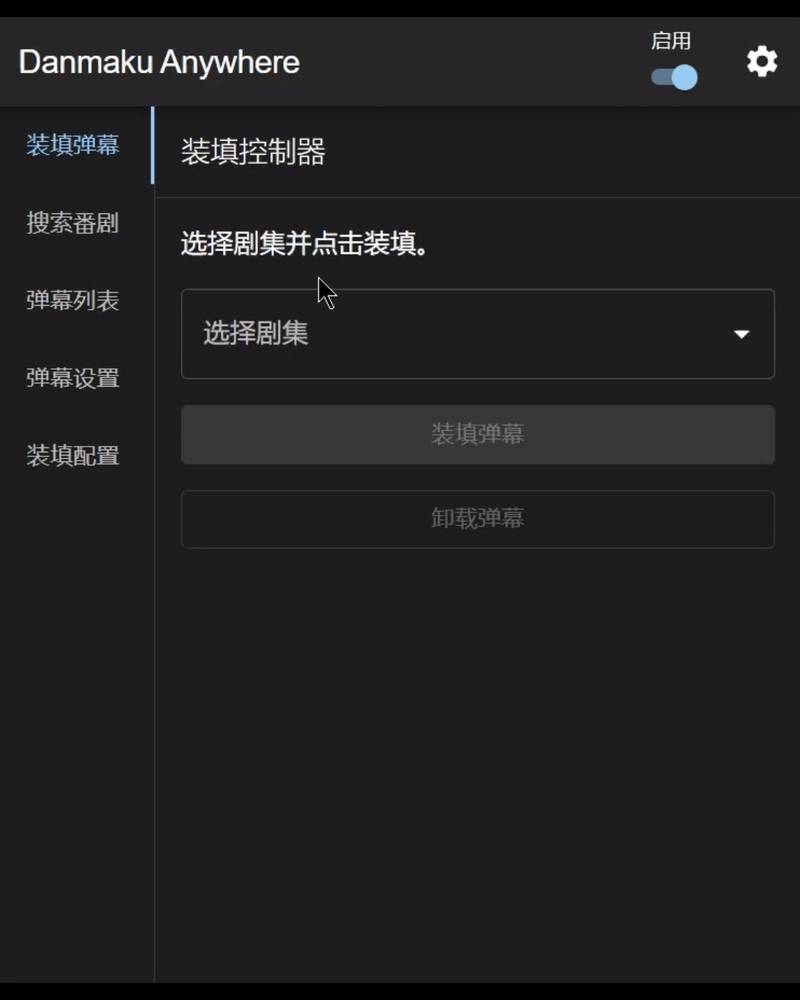

<div align="center">
  
  <h1>
    Danmaku Anywhere
  </h1>
</div>

> 没有弹幕怎么看番？
> Danmaku Anywhere是一个可以在任何视频网站上加载弹幕的浏览器插件

[中文] [English](./README.en.md)

## 功能

- 按动画搜索弹幕
- 将弹幕嵌入视频
- 自定义弹幕样式
- 本地弹幕缓存并导出为文件
- 自动根据视频匹配弹幕🚧

所有弹幕均来自 [弹弹 play](https://www.dandanplay.com/)

## 截图



Plex


Crunchyroll


## 安装

### Chrome

直接通过[商店](https://chromewebstore.google.com/detail/danmaku-anywhere/jnflbkkmffognjjhibkjnomjedogmdpo?authuser=1&hl=zh)
安装（**推荐**）

#### 手动安装

> [!NOTE]
> 手动安装无法自动更新，如非必要建议通过商店安装

1. 下载对应浏览器[最新发布的版本](https://github.com/Mr-Quin/danmaku-anywhere/releases/latest)
   然后解压到任意文件夹。除非卸载扩展，请勿删除此文件夹。
2. 进入扩展页面[chrome://extensions/](chrome://extensions/)并启用开发者模式。
3. 点击 "加载未打包的扩展" 并选择已解压的扩展文件夹。
4. 后续的更新直接解压到这个文件夹中并覆盖即可

### Firefox

Firefox版本相比Chrome版本有更多的限制，并且由于部分API缺失，一些功能可能无法使用。

使用Firefox浏览器，从[这里](https://mr-quin.github.io/danmaku-anywhere/)下载并安装。

#### 手动安装

手动安装需使用开发者版本的Firefox。

安装详情见[这里](https://extensionworkshop.com/documentation/develop/temporary-installation-in-firefox/)
和[这里](https://extensionworkshop.com/documentation/publish/signing-and-distribution-overview/)

## 使用指南

> [!NOTE]
> 文档并不完整，如果使用中遇到问题欢迎提出issue

此扩展程序提供两种模式：

- 手动模式： 手动搜索、装填和卸载各个剧集的弹幕。可用于任何网站。
- 自动模式： 自动匹配并装填弹幕，但是需要对每个网站进行适配（目前仅适用于 [Plex](https://www.plex.tv/)，包括自架版本）

### 1. 添加装填配置

装填配置决定在什么网站的什么位置加载弹幕

- 在扩展弹出窗口中，打开“装填配置”页
- 如果你的网站在预设配置中，点击按钮启用即可。若有已经打开的网站需要刷新。
- 如果你的网站不在预设列表中，点击“+”并按照提示填写配置信息。
    - URL模式（URL Patterns）： 网站的URL格式，例如：`https://your.website.com/*`
        - 使用[匹配模式](https://developer.mozilla.org/zh-CN/docs/Mozilla/Add-ons/WebExtensions/Match_patterns)格式。
        - 如果你的网站的视频元素位于`iframe`中，此处应填写`iframe`的地址，通过查看`iframe`的`src`属性获得。
    - 视频元素：通常为`video`。
        - 使用[CSS选择器](https://developer.mozilla.org/zh-CN/docs/Web/API/Document/querySelector)格式。
        - 一些视频网站比较特殊，例如页面中有多个`video`的情况需要填写更详细的选择器。

### 2. 搜索弹幕（手动模式）

手动模式下需要手动搜素弹幕，之后进行装填

- 在扩展弹出窗口中，打开“搜索番剧”页
- 填写番剧标题
- 集数建议留空
- 在返回的结果中展开需要的番剧，点击单个集数下载弹幕

> [!TIP]
> 如果返回结果为空，可能是因为番剧名称的汉化差异导致的。例如：搜“夜晚的水母不会游泳”没有结果，搜”夜之水母不会游泳“就有了。
> 可以多尝试几个名称，或者搜索日文原名，英文译名等

### 3. 装填弹幕（手动模式）

> [!NOTE]
> 在操作前，请确认能在页面上看到由此扩展注入的蓝色按钮。
> 如果看不到，请确认以为当前页面添加装填配置，并且配置以启用

- 在扩展弹出窗口中，打开“装填弹幕”页
- 在下拉菜单中选择剧集并点击“装填弹幕”将弹幕注入当前打开的标签页。
- 手动模式下,换集，换番剧等情况不会自动切换弹幕，需要重复以上步骤。
- 如果需要移除弹幕，点击“卸载弹幕”。

> [!TIP]
> 如果“装填弹幕”页提示不存在当前页面的装填配置但是你确定有的话，可以尝试：
>
> - 禁用再启用配置并刷新页面
> - 重启浏览器
> - 提交bug

### 自动模式

在自动模式下拓展会自动识别正在播放的番剧并匹配弹幕。如果自动模式出现问题，可以随时关闭自动模式进行手动装填。

自动模式需要对网站进行单独适配，目前仅支持Plex。如果希望适配某个网站欢迎提出issue。

以下为自动模式的一些注意事项：

#### Plex

在装填配置的适配选项中选择Plex。

- 拓展使用正在播放的媒体名称和集数来查找番剧，请确保媒体信息准确。推荐在媒体库中使用Plex Series和Plex Movie代理进行匹配。
- 拓展无法分辨正在播放的媒体是否为视频。如果正在播放的媒体不是视频（音乐，图片等），请先通过快捷按钮关闭弹幕或关闭自动模式。

### 弹幕样式

在扩展弹出窗口的“弹幕样式”页中设置

### 自定义弹幕

其他来源的弹幕可以在“弹幕列表”-“导入弹幕”中导入

导入前需转换为以下格式

```typescript
interface CustomComment {
    mode?: 'ltr' | 'rtl' | 'top' | 'bottom'; // 弹幕模式，默认为 rtl（从右至左）
    time: number; // 弹幕出现时间，单位为秒
    color: string; // 弹幕颜色，hex格式，如 #FFFFFF
    text: string; // 弹幕内容
}

interface CustomDanmaku {
    comments: CustomComment[]; // 弹幕列表，至少一条
    animeTitle: string; // 番剧标题
    // 单集标题和编号至少填写一个，用于区分同一番剧不同集数的弹幕
    episodeTitle?: string; // 单集标题
    episodeNumber?: number; // 单集编号
}

type CustomDanmakuList = CustomDanmaku[];
```

例

```json
[
  {
    "comments": [
      {
        "mode": "rtl",
        "time": 10,
        "color": "#FF5733",
        "text": "Hello World"
      }
    ],
    "animeTitle": "Anime Title",
    "episodeTitle": "Episode Title"
  }
]
```

## 开发

见[英文文档](./README.en.md#development)

## 猴油脚本（停止维护）

通过[这里](https://mr-quin.github.io/danmaku-anywhere/)安装

文档[plex-danmaku](./packages/plex-danmaku)
