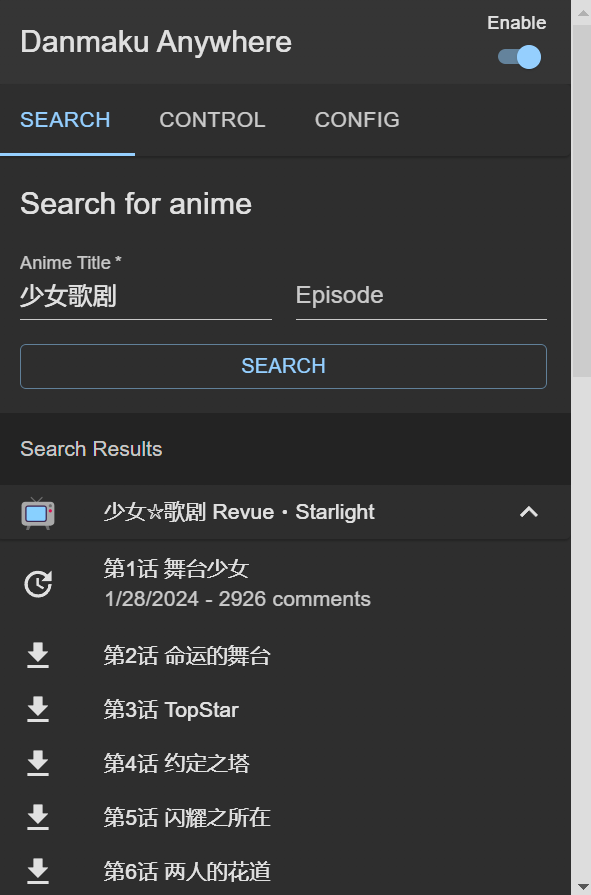
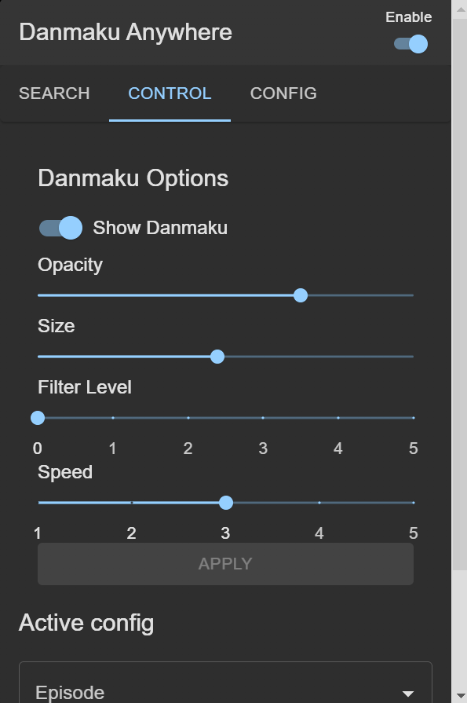
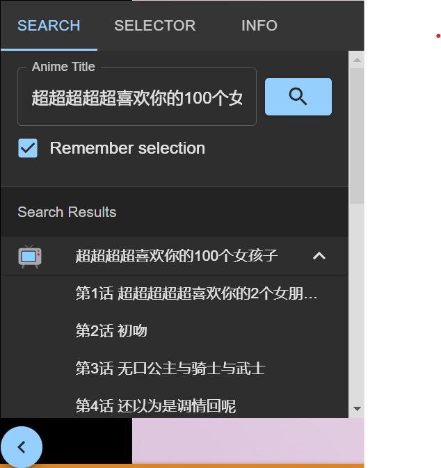

# danmaku-anywhere

[English](./README.en.md)

> danmaku-anywhere 是一个理论上可以在任何视频网站上加载弹幕的浏览器插件.

## 功能 🚧

任何网站都可用:

- 按动画搜索弹幕
- 将弹幕嵌入视频
- 自定义弹幕样式
- 本地弹幕缓存并导出为文件

需网站适配: 🚧

- 自动检测播放的动画并匹配弹幕

目前只有 [Plex](https://www.plex.tv/) 实现了适配

所有弹幕均来自 [弹弹 play](https://www.dandanplay.com/)

## 安装

下载[最新发布的版本](https://github.com/Mr-Quin/danmaku-anywhere/releases/latest)

### Chrome

1. 进入扩展页面 [chrome://extensions/](chrome://extensions/) 并启用开发者模式。
2. 点击 "加载未打包的扩展" 并选择已解压的扩展文件夹。

## 截图

Plex

Crunchyroll

UI

## 开发

见[英文文档](./README.en.md#development)
