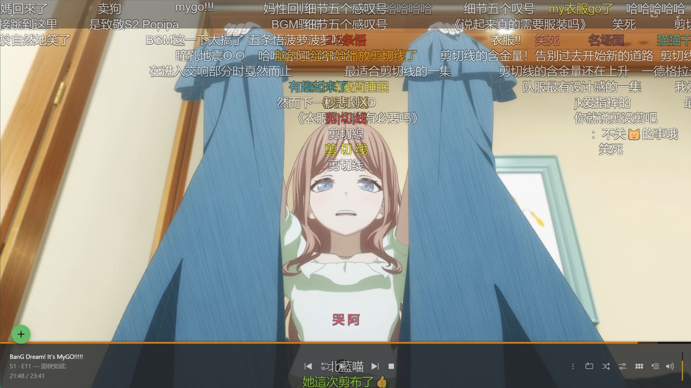
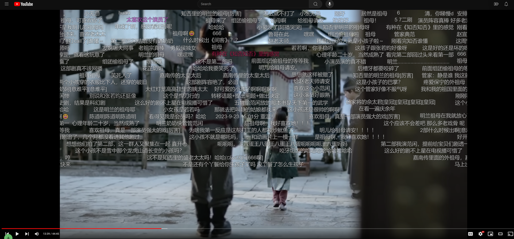

  
  <h1>
    Danmaku Anywhere
    

      
      
      
      
    

  </h1>

> 没有弹幕怎么看番？
> Danmaku Anywhere是一个可以在任何视频网站上加载弹幕的浏览器扩展

## 功能

- 在任何有视频的网页上加载弹幕，彻底解决看番无弹幕的问题
- 从多个弹幕源获取弹幕，目前支持：
  - 弹弹Play
  - B站
  - 腾讯
- 手动导入其他来源的弹幕文件，支持常见的`.xml`格式
- AI自动匹配视频弹幕
- 可自定义的弹幕样式
- 导出本地缓存的弹幕

## 截图

<video src="https://github.com/user-attachments/assets/81703fe1-d04f-42cb-b9ed-35213c75f2e0"></video>

Plex

Jellyfin

YouTube

## 安装

### Chrome（Chromium内核浏览器）

直接通过[Chrome Web Store](https://chromewebstore.google.com/detail/danmaku-anywhere/jnflbkkmffognjjhibkjnomjedogmdpo?hl=zh)安装

### Firefox（含安卓）

直接通过[Firefox Add-ons](https://addons.mozilla.org/zh-CN/firefox/addon/danmaku-anywhere/)安装

手动安装及更详细的说明请看 [快速上手](https://docs.danmaku.weeblify.app/getting-started/)

## 开发

见[开发文档](https://docs.danmaku.weeblify.app/development/structure/)

