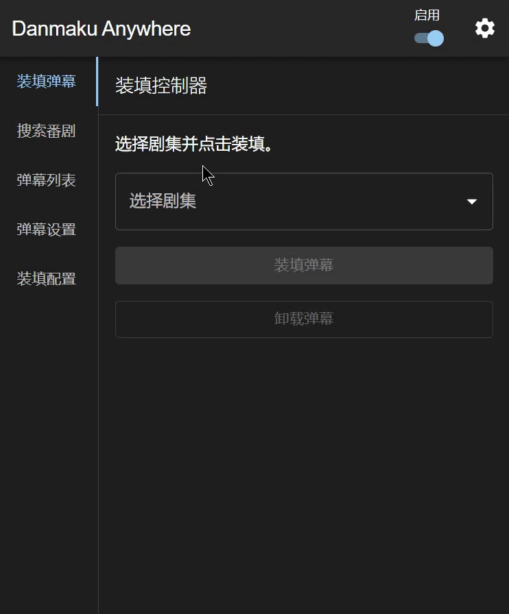

  
  <h1>
    Danmaku Anywhere
  </h1>

> 没有弹幕怎么看番？
> Danmaku Anywhere是一个可以在任何视频网站上加载弹幕的浏览器插件

[中文] [English](./README.en.md)

## 功能

- 按节目搜索弹幕
- 将弹幕嵌入视频
- 自定义弹幕样式
- 本地弹幕缓存并导出为文件
- 自动根据视频匹配弹幕

## 截图

Plex

Jellyfin

YouTube

## 安装

### Chrome

直接通过[商店](https://chromewebstore.google.com/detail/danmaku-anywhere/jnflbkkmffognjjhibkjnomjedogmdpo?hl=zh)安装

Firefox和更详细的说明请看 [快速上手](https://danmaku.weeblify.app/getting-started/)

## 开发

见[英文文档](./README.en.md#development)
