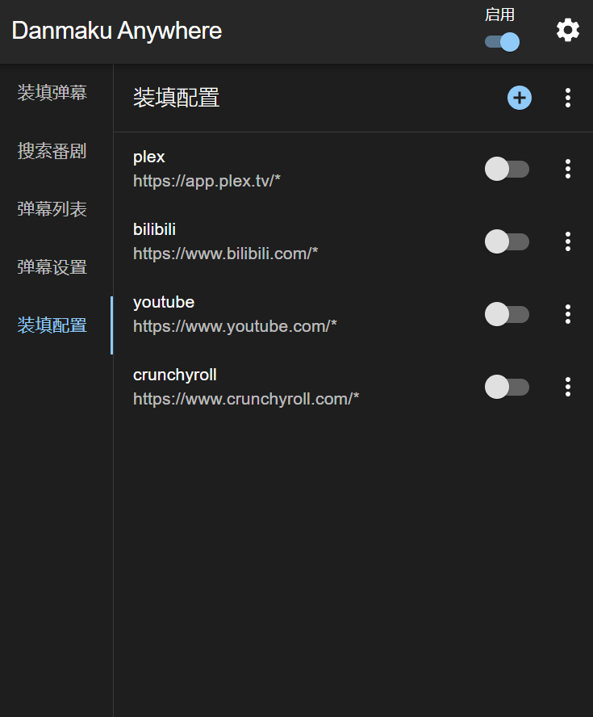

## 系统要求

最新版本的 Chrome、Edge 或其他基于 Chromium 内核的浏览器。

:::note
此扩展主要支持 Chromium 内核的浏览器，如 Chrome、Edge 等，并上架了 Chrome 应用商店。虽然会同时发布 Firefox 版，但是没有上架到 Firefox 商店，也没有精力测试，所以不推荐使用。
:::

## 下载

### Chrome

包括 Chrome、Edge、Opera 等基于 Chromium 内核的浏览器。

从 [Chrome 应用商店](https://chromewebstore.google.com/detail/danmaku-anywhere/jnflbkkmffognjjhibkjnomjedogmdpo?hl=zh) 下载安装（推荐）

使用商店安装可以自动更新，以及多设备同步设置。

无法使用商店的，或者需要手动安装的，见 [安装说明](/docs/install#chrome)

### Firefox

见 [安装说明](/docs/install#firefox)

## 首次使用

**此扩展并非开袋即食**，首次使用前需要进行一些配置。

点击浏览器右上角的扩展图标，打开弹出窗口，然后点击“装填配置”页。

如果你的网站在预设配置中，点击按钮启用即可。没有的话，点击右上角的加号，按照提示添加新的配置。详情见 [装填配置](/docs/mount-profile)

完成配置后，打开或刷新你的视频网站，左下角会出现控件的悬浮按钮，

这样就算配置完成了。

如果需要在其他网站使用，重复上述步骤即可。

## 获取弹幕

弹幕有 3 种来源：

1. 内置搜索
2. 地址解析
3. 用户上传

### [内置搜索](/docs/danmaku#内置搜索)

在搜索页输入关键词，然后点击搜索按钮，即可搜索到相关的弹幕，点击弹幕即可下载。

支持的弹幕来源有

- 弹弹 Play
- B站
- 腾讯

其中**弹弹Play**为默认开启的，其余的需要在设置页中开启。

部分搜索结果受登录状态，地域等因素影响

### [地址解析](/docs/danmaku#地址解析)

在搜索页选择**地址解析**标签页，输入视频地址，然后点击解析按钮，即可解析到相关的弹幕。

此功能不适用于所有视频，具体见[弹幕管理](/docs/danmaku#地址解析)

### [用户上传](/docs/danmaku#用户上传)

在弹幕列表页，打开右上角的菜单，选择“上传弹幕”，然后选择你的弹幕文件（可多选），即可上传。

支持的弹幕格式有：.xml, .json

如果发现上传的弹幕文件解析失败，可能是尚不支持这个格式，请提交 [功能请求](https://github.com/Mr-Quin/danmaku-anywhere/issues/new)。

## 加载弹幕

有了弹幕后，在悬浮窗口中的“装填弹幕”页中可以查看，点击“装填”按钮即可加载弹幕。此时控件按钮会变绿，播放视频即可看到弹幕。
