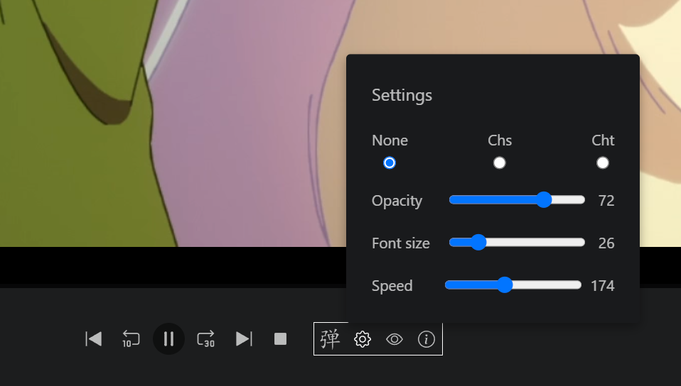

# plex-danmaku (legacy)

## This project is no longer being maintained

A user script that adds danmaku (弹幕) to Plex videos.

Based on [lsl330/plex-danmaku](https://github.com/lsl330/plex-danmaku)

Bootstrapped with [vite-plugin-monkey](https://github.com/lisonge/vite-plugin-monkey)

## Installation

Install the script [here](https://mr-quin.github.io/plex-danmaku/plex-danmaku.user.js).

Add your Plex server address to the script @match header if needed.

## Screenshots

